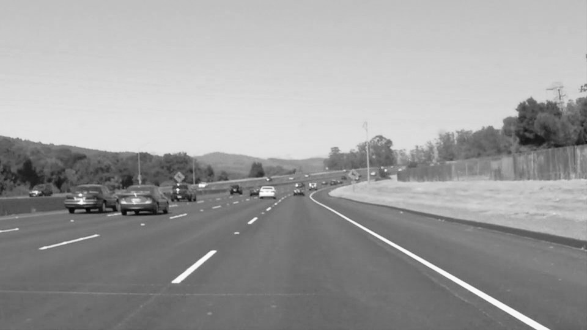
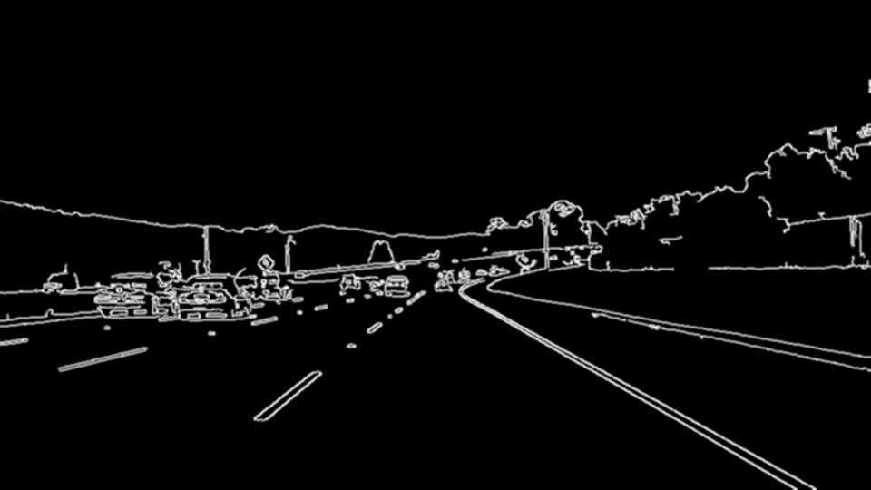
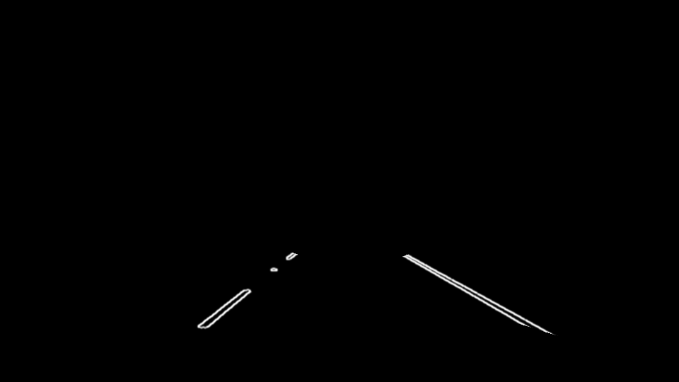
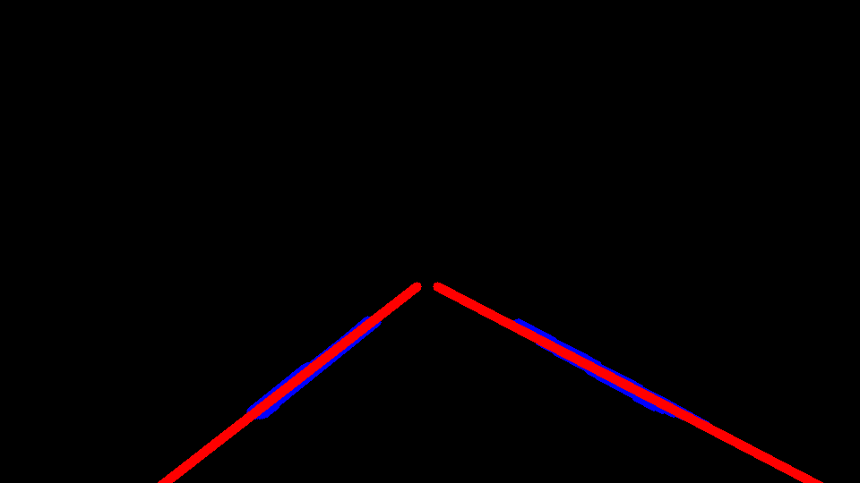
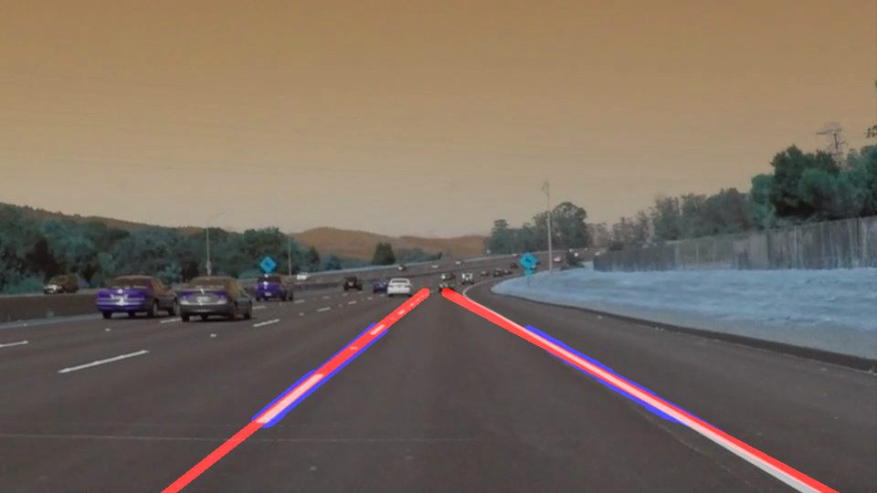

# **Finding Lane Lines on the Road** 

## Writeup

### This is a writeup for the project to find lane lines on the road and highlight them.

---

**Finding Lane Lines on the Road**

The goals / steps of this project are the following:
* Make a pipeline that finds lane lines on the road
* Reflect on the work in a written report

[//]: # (Image References)

---

### Reflection

### 1. Pipeline description.

The pipeline for finding the lane lines consists of following steps.

* First read the image and convert it to grayscale.

* Edges are detected using the edge detection algorithm.

* To filterout the noise, Gaussian blur is applied to grayscaled image.

* Next we need to find the region between the lane lines(region of interest).

* All the x,y coordinates that belong to the lane lines need to be found. For this Hough transform is applied on the image from the previous step. The hough transform provided the coordinates of start & end point of all the lines that are detected in the image. 
Lines corresponding to left and right lanes are identified and drawn. 
The output is as shown here.

* Combining the output of previous step with original image we get an image with only lane lines highlighted.

---

### 2. Potential shortcomings with the current pipeline

As the parameters in various techniques used to find lanes are hardcoded above pipeline may not provide consistent out put in differet road and lightning conditions. Also while finding region of interest the boundry coordinates are set manually this may cause issues if image is of different resolution and changes in camera position. 

---

### 3. Possible improvements to the pipeline

1. Dynamic setting of parameter values for various transforms.
2. Detection of curved lane lines.
3. Smooth detection of lane lines by averaging the lines detected in previous farmes of video.
